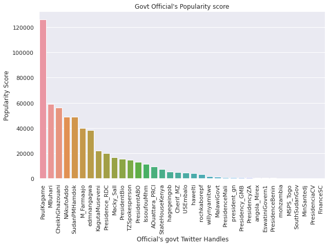

## Defining user segmentation in social media through the use of Twitter mining

An informed insight on how an individual has an influence on others in a circle can help a business create social media campaigns that aid in marketing and advertising. An approach to determine this is summarized here with explanations of how to use tweepy API in python to extract data and how to use the data obtained
to rank the users. Users are ranked based on their influence.

This blog is among the challenges undertaken at [10 Academy](https://www.10academy.org/) training in July 2020.

## Problem statement
What determines the level of influence a user has on social media?
A study is made to make an understanding of the effects of the social media influencers are in Africa to inform a Social media campaign based on the following factors;

1. Popularity (Retweet Influence): measured by the number of Retweets and Likes users get
2. Reach (Indegree Influence): measured by the size of their audience i.e followers and following.
3. Relevance (Mentions Influence): measured by the relevancy of their content i.e user mentions.

## Methodology
## Data Extraction
## Webscraping
In the extraction of the data, I scrapped [Africa Influential Tweeter](https://africafreak.com/100-most-influential-twitter-users-in-africa)
and [Africa	leaders response to Corona virus](https://www.atlanticcouncil.org/blogs/africasource/african-leaders-respond-to-coronavirus-ontwitter/#east-africa) websites to obtain the twitter accounts of the most influential Twitter users and top African leaders respectively.
## Twitter mining data.
Next, I use the tweeter APIs to extract data for the twitter users obtained.
First, I import the needed packages. Tweepy is a must when dealing with data from Twitter. Pandas is always the best for munging and process data.
```
import tweepy
import pandas as pd
```
Next, I provide four keys/tokens from my Twitter App Developer as this is the second step for any Tweepy operation. Then I initiate the authentication and pass it with 
Tweepy API to access information about the Twitter handles obtained above
```
#providing twitter Api
consumer_key = (YOUR TWITTER_API_KEY)
consumer_secret = (YOUR TWITTER_API_SECRET)
access_token = ( YOUR TWITTER_ACCESS_TOKEN)
access_token_secret = ( YOUR TWITTER_ACCESS_TOKEN_SECRET)

#Initiating the aunthetication
auth = OAuthHandler(consumer_key, consumer_secret)
auth.set_access_token(access_token, access_token_secret)
self.auth = auth
self.api = tweepy.API(auth, wait_on_rate_limit=True)
```
## Data Processing
In ensuring data quality control and correct inference of the results during analysis, I cleaned the data keeping in mind the variables of interest i.e number of followers, number of following users, user mentions, retweet count, favorite count, and the hashtag used by the users. Below is a breakdown of the variables of interest and the measures of ranks used.
* Popular score: retweet count and retweet count
* Relevance score: user mentions
* Reach score: number of followers and user's following

## Data analysis.
I did visualization on the clean to data to help get the insight into the trend in the data. The main focus was on the three ranking scores of measuring influence; popular score, Relevance score and Reach score.
### 1.Popular score
I obtained the popularity score by ranking the users(government officials and most twitter influencers) based on their total number of retweet count and the likes they got on each tweet.
```
###Popularity score
#Parameters of interest = No of retweets, Favorite count.
Popular_score_official = Officials_data[['original_author','favorite_count','retweet_count']]
grouping by original author.
Popular_score_official = Popular_score_official.groupby('original_author').sum()

#Creating Popular Score.
Popular_score = Popular_score_official['favorite_count'] + Popular_score_official['retweet_count']
Popular_score_official['Popular_score'] = Popular_score

Popular_score_official=Popular_score_official.sort_values("Popular_score",ascending=False)
Popular_score_official = Popular_score_official.reset_index()  #resetting the index
Popular_score_official

##Barplot.
import matplotlib.pyplot as plt
%matplotlib inline

##Barplot
fig= plt.figure(figsize=(10,6))
sns.barplot(x="original_author",y="Popular_score",data=Popular_score_official)
plt.xticks(rotation = 90)
plt.xlabel(" Official's govt Twitter Handles")
plt.ylabel("Popularity Score")
plt.title("Govt Official's Popularity score")
plt.show()
```
 

### 2.Reach score
I obtained the reach score by ranking the users(government officials and most twitter influencers) based on their total number of followers and the numbers they are following.
```
###Reach score
#Parameters of interest = No of retweets, Favorite count.
Reach_score_official = Officials_data[['original_author','followers','following']]

Reach_score_official = Reach_score_official.drop_duplicates('original_author')
#Creating Popular Score.
Reach_score = Reach_score_official['followers'] + Reach_score_official['following']
Reach_score_official['Reach_score'] = Reach_score

Reach_score_official = Reach_score_official.sort_values("Reach_score",ascending=False)
Reach_score_official =Reach_score_official.reset_index(drop=True)
Reach_score_official

##Barplot.
import matplotlib.pyplot as plt
%matplotlib inline

##Barplot
##Barplot
fig= plt.figure(figsize=(10,6))
sns.barplot(x="original_author",y="Reach_score",data=Reach_score_official)
plt.xticks(rotation = 90)
plt.xlabel(" Official's govt Twitter Handles")
plt.ylabel("Reach Score")
plt.title("Govt Officials Reach score")
plt.show()
```
 
### 3.Relevance score
I obtained the Relevance score by ranking the users(government officials and most twitter influencers) based on user mentions.
```
###Relevance score
#Parameters of interest = No of retweets, Favorite count.
#Creating a data frame with 
Relevance_score_official= Officials_data[['original_author','user_mentions']]

#Checking for missingness.
Relevance_score_official.isnull().sum()  

Relevance_score_official = Relevance_score_official.groupby('original_author').count()
Relevance_score_official=Relevance_score_official.sort_values("user_mentions",ascending=False)
Relevance_score_official =Relevance_score_official.reset_index()
Relevance_score_official

##Barplot
fig= plt.figure(figsize=(10,6))
sns.barplot(x="original_author",y="user_mentions",data=Relevance_score_official)
plt.xticks(rotation = 90)
plt.xlabel(" Official's govt Twiiter Handles")
plt.ylabel("Relevance Score")
plt.title(" Government Officials Relevance score ")
plt.show()
```
 

## Findings
From the analysis, using the above scores, it was shown that the most influential users addressed matters Corona Virus which is under health and well-being, Human rights, and politics. I obtained this by plotting a bar graph of the most influential users based on the ranks against the most used hashtags.


## Conclusion and Recommendation

Retweet influence, mentions influence, and indegree influence has big a role to play in determining the
level of influence a user has on society and its environment. And this is a strength that can be
tapped into and utilized by businesses to push products and services through campaigns by partnering
with the most influential users through marketing and advertising. This is dependent on the category of the content of the user. I would recommend other factors that determine a user’s influence to be factored in determining if one is more influential than the use of the three ranks of measuring influence. For instance, the interpersonal relationship of a user with the virtual community can be considered. 

### Resources
[Measuring User Influence in Twitter: The Million Follower Fallacy](http://twitter.mpi-sws.org/icwsm2010_fallacy.pdf)

[Web Scraping using Python](https://www.edureka.co/blog/web-scraping-with-python/)

[How to calculate Twitter impressions and reach](https://www.tweetbinder.com/blog/twitter-impressions/)

